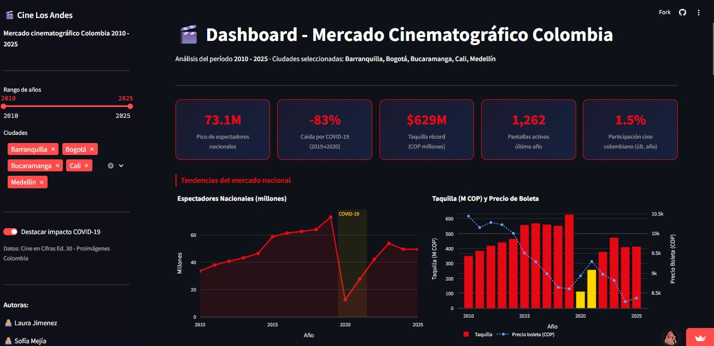

# Análisis de datos de Cine Los Andes - cine Colombiano


## 📋 Descripción del proyecto
Este proyecto realiza un análisis exhaustivo de datos del cine colombiano utilizando información de CineEnCifras y la base de datos de películas de Los Andes. El pipeline incluye extracción de datos desde PDF, procesamiento, análisis exploratorio de datos (EDA) y visualización interactiva a través de un dashboard en Streamlit.

## 🚀 Instalación y configuración

### 1. Clonar el repositorio

``` bash
git clone https://github.com/lau2413/Trabajo_Final_Data_Office.git
cd Trabajo_Final_Data_Office
git checkout sofia 
```

### 2. Crear el entorno virtual

``` bash
python -m venv venv
```

### 3. Activar el Entorno Virtual
En Windows:
``` bash
venv\Scripts\activate
```

En Mac/Linux:
``` bash
source venv/bin/activate
```

### 4. Instalar dependencias
``` bash
pip install -r requirements.txt
```

### 5. Configurar variables de entorno
Crear un archivo .env en la raíz del proyecto con el siguiente contenido:

``` bash
GEMINI_API_KEY=tu_api_key_aqui
```

La API key de Gemini se puede obtener en Google AI Studio

## 📊 Ejecución del proyecto

### 1. Extracción de datos del PDF
``` bash
python scripts/extract_cine_cifras.py CineEnCifras30.pdf
```

Este script extrae los datos del documento PDF de CineEnCifras.

### 2. Ejecutar el pipeline de procesamiento
``` bash
cd scripts
python ejecutar_pipeline.py
```

> Este paso procesa y limpia los datos extraídos, preparándolos para el análisis.

### 3. Acceder al dashboard de Streamlit


Está disponible en: https://cine-los-andes-panel-estrategico.streamlit.app/

#### 📈 Dashboard interactivo
El dashboard de Streamlit incluye:

* Visualizaciones interactivas de las tendencias del cine colombiano. 
* Análisis exploratorio de datos (EDA) con gráficos dinámicos
* Filtros personalizables para explorar diferentes aspectos de los datos
* Métricas clave sobre producción cinematográfica, taquilla y audiencias
* Comparativas temporales y análisis de tendencias

#### Características del dashboard

* Interfaz intuitiva y responsive
* Gráficos interactivos con Plotly
* Exportación de visualizaciones
* Filtrado en tiempo real de datos

## 🛠️ Tecnologías utilizadas
* **Python** 3.x
* **Streamlit** - Dashboard interactivo
* **Pandas** - Procesamiento de datos
* **Gemini API** - Procesamiento con IA
* **pdfplumber** - Extracción de datos PDF
* **Plotly** - Visualización de datos

## 👥 Equipo
Proyecto desarrollado como parte del Trabajo Final de Data Office

Autoras:
* Laura Jiménez Moreno
* Sofia Mejía Rivas